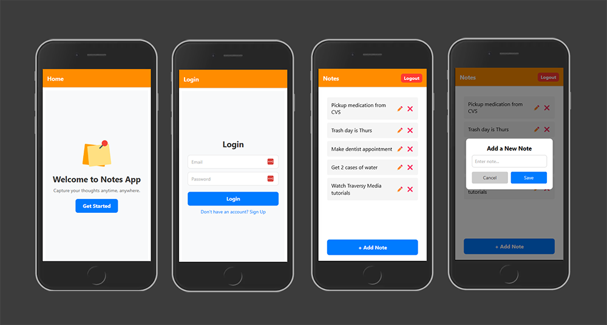

# 🧠 Mental Reset – My First React Native App

## Table of Contents

- [Overview](#overview)
  - [Screenshots](#screenshots)
- [My Process](#my-process)
  - [What I Learned](#what-i-learned)
  - [Continued Development](#continued-development)
  - [My Tech Stack](#my-tech-stack)
  - [Useful Resources](#useful-resources)

---

## Overview

This is my first React Native app built using [Brad Traversy's](https://www.youtube.com/@TraversyMedia) full tutorial — created with **Expo** and connected to **Appwrite** as the backend.

It allowed me to explore cross-platform mobile development, and I structured the UI and logic with my existing frontend knowledge (React, Tailwind, etc.).

### Screenshots

  

---

## My Process

### What I Learned

✅ **New tools & mobile workflow:**

- Using **Expo CLI** to develop and test on mobile
- Structuring navigation with **React Navigation**
- Using **Appwrite** for auth and backend logic
- Managing mobile state and UI design

🔧 **Mindset growth:**

- Learned to debug mobile app errors (Expo & Appwrite especially)
- Stayed focused despite starting with zero native experience
- Developed the discipline to finish even when momentum dropped

---

### Continued Development

🚀 In future versions, I want to:

- Improve design using native styling or Tailwind Native
- Add features like user profile pictures and push notifications
- Connect to a proper production backend and deploy it

---

### My Tech Stack

🛠️

- **Framework:** React Native with Expo
- **Backend:** Appwrite
- **Navigation:** React Navigation
- **Styling:** StyleSheet API
- **Authentication:** Appwrite's built-in email/password auth

---

### Useful Resources

📚

| Resource                 | Description                              | Link                                                         |
| ------------------------ | ---------------------------------------- | ------------------------------------------------------------ |
| Brad Traversy's Tutorial | The main guide I followed for this app   | [Watch it here](https://www.youtube.com/watch?v=bCpFbERgj7s) |
| Expo Documentation       | Expo CLI, APIs, and building tools       | [expo.dev](https://docs.expo.dev/)                           |
| Appwrite Documentation   | Backend as a service (auth, db, storage) | [appwrite.io/docs](https://appwrite.io/docs)                 |
| React Native Docs        | Core concepts and API reference          | [reactnative.dev](https://reactnative.dev/)                  |
| React Navigation Docs    | Routing and navigation for RN            | [reactnavigation.org](https://reactnavigation.org/)          |

---

🙌 I'm excited to now build faster apps with both **React** and **React Native**!  
If you're a small business or recruiter — I'm ready to help you build great user experiences. ✨
